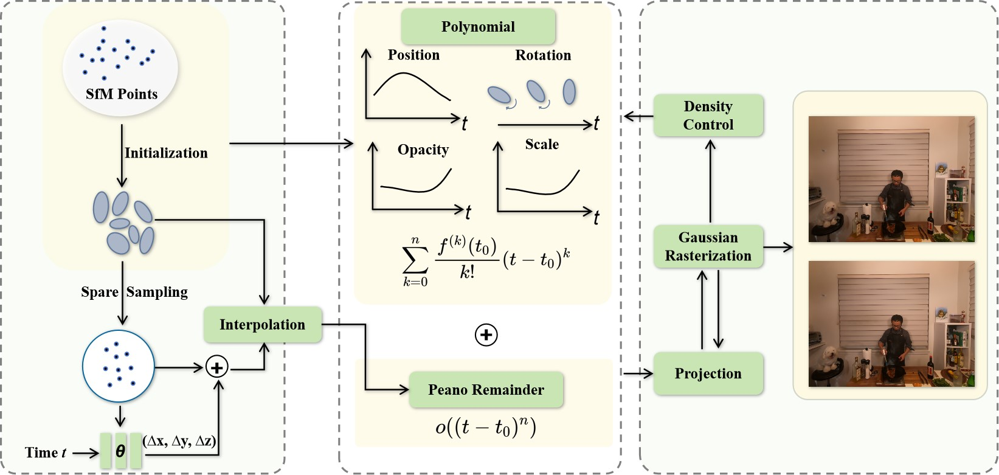

[comment]: <> (# Learnable Infinite Taylor Gaussian for Dynamic View Rendering)

<!-- PROJECT LOGO -->

  <h1 align="center"> Learnable Infinite Taylor Gaussian for Dynamic View Rendering
  </h1>
  

    

    <strong>Bingbing Hu </strong> ·
    <strong>Yanyan Li</strong> ·
    <strong>Rui Xie </strong> ·
    <strong>Bo Xu</strong> ·
    <strong>Haoye Dong</strong> ·
    <strong>Junfeng Yao</strong>  ·
    <strong>Gim Hee Lee </strong>
    

  

[comment]: <> (  <h2 align="center">PAPER</h2>)
  <h3 align="center"><a href="https://arxiv.org/pdf/2412.04282">Paper</a> | <a href="https://ellisonking.github.io/TaylorGaussian/">Project Page</a></h3>
  

  

# Motivation

Instead of relying on **time-conditioned polynomial functions** to approximate Gaussian trajectories and directions, this solution investigates a more **accurate Gaussian evolution** model for dynamic scenarios.

# TODO Lists
- [x] *Repo* - Create repo for [TaylorGaussian](https://ellisonking.github.io/TaylorGaussian).
- [ ] *Clean* - Clean the system
- [ ] *Test* - Test the system on different Ubuntu servers
- [ ] *Code* - Release code to the community

# 1.Installation

# 2.Pretrained Models

# 3.Datasets

# 4.Acknowledgement
This work incorporates many open-source codes. We extend our gratitude to the authors of the software.

# 5.License

# 6.Citation
If you find this code/work useful for your own research, please consider citing:

