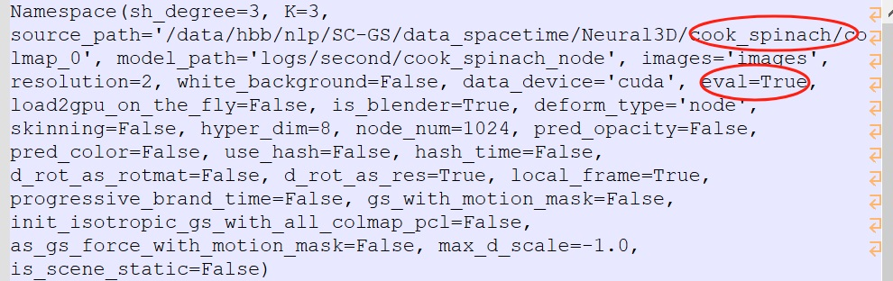
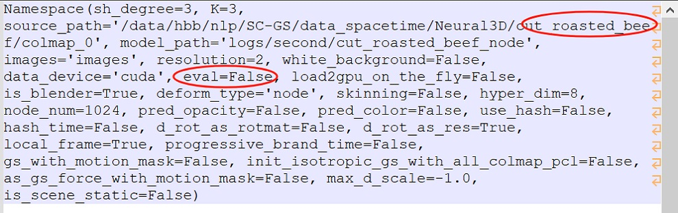

# Introduction of Experimental Logs 

The source code of our [latest arXiv paper](https://arxiv.org/abs/2412.04282v2) has been released in this repository. Please feel free to test it if you are interested.
For the false setting problem in the Table 1 of our [first arXiv paper](https://arxiv.org/pdf/2412.04282v1), we provide the detailed training settings and experimental logs for each sequence below:


| Scene            | Cook Spinach | Sear Steak | Flame Steak | Flame Salmon | Coffee Martini | Cut Roast Beef |
|------------------|:------------:|:----------:|:-----------:|:------------:|:--------------:|:--------------:|
| Training Setting |    correct   |    wrong   |    wrong    |     wrong    |      wrong     |      wrong     |
| Parameter Setting |   `eval=True`  | `eval=False` |  `eval=False` |  `eval=False`  |   `eval=False`   |    `eval=False`  |
| Timestamp of Files |   2024.11.05 | 2024.11.05 | 2024.11.05  |  2024.11.04  |   2024.11.04   |    2024.11.05  |
| Config Args      | [cfg_args](/experimental_logs/asset/cook_spinach_node.zip) | [cfg_args](/experimental_logs/asset/sear_steak_node.zip) | [cfg_args](/experimental_logs/asset/flame_steak_node.zip) | [cfg_args](/experimental_logs/asset/flame_salmon_1_node.zip) | [cfg_args](/experimental_logs/asset/coffee_martini_node.zip) | [cfg_args](/experimental_logs/asset/cut_roasted_beef_node.zip) |


### ✅ Notes:

**1.Config Args**

<p align="center">
  <a href="">
    
  </a>
  <a href="">
    
  </a>
</p>

**2.Timestamp of Files**
These files were generated during the previous experiments. You can easily retrieve the timestamp of each file using the following commands:

- **On Ubuntu**:
```
cd asset
unzip cook_spinach_node.zip 
cd cook_spinach_node
ls -l --time-style=long-iso
```
where the date is the timestamp, like this:
```
2024-11-05 14:21 cfg_args
2024-11-05 20:40 test_43000_runtimeresults.json
```

- **On Windows**: 
just right-click → Properties → check "Modified" time.